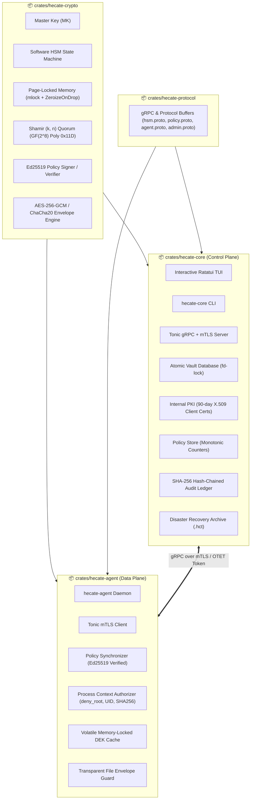

```
██╗  ██╗███████╗ ██████╗ █████╗ ████████╗███████╗   ██╗   ██╗ █████╗ ██╗   ██╗██╗  ████████╗
██║  ██║██╔════╝██╔════╝██╔══██╗╚══██╔══╝██╔════╝   ██║   ██║██╔══██╗██║   ██║██║  ╚══██╔══╝
███████║█████╗  ██║     ███████║   ██║   █████╗     ██║   ██║███████║██║   ██║██║     ██║   
██╔══██║██╔══╝  ██║     ██╔══██║   ██║   ██╔══╝     ╚██╗ ██╔╝██╔══██║██║   ██║██║     ██║   
██║  ██║███████╗╚██████╗██║  ██║   ██║   ███████╗    ╚████╔╝ ██║  ██║╚██████╔╝███████╗██║   
╚═╝  ╚═╝╚══════╝ ╚═════╝╚═╝  ╚═╝   ╚═╝   ╚══════╝     ╚═══╝  ╚═╝  ╚═╝ ╚═════╝ ╚══════╝╚═╝   
```

<div align="center">

### Enterprise Software HSM, Asymmetric Policy Governance, Transparent File Guard, and Tamper-Evident Security Vault in Rust.

[](https://github.com/luciano-sparti/hecate-vault/actions)
[](LICENSE)
[](https://www.rust-lang.org/)
[](https://ratatui.rs)
[](https://github.com/hyperium/tonic)
[](crates/hecate-crypto)
[](https://kernel.org)

<br/>

```
┌─ [🛡️ HECATE VAULT] ───────────┬─ [Overview: Executive Posture Dashboard] ──────────────────────┐
│                               │                                                                │
│  [1] 📊 Overview              │  ┌─ HSM Root of Trust ──┐ ┌─ Key Inventory ──┐ ┌─ Agent Nodes ─┐  │
│  [2] 🛡️ Agents & Clients      │  │ State: ACTIVE 🟢     │ │ Managed KEKs: 2  │ │ Enrolled: 1   │  │
│  [3] 🔑 Key Management        │  │ Provider: TPM2-SEAL  │ │ Total Ver:   3   │ │ Compliant: 1  │  │
│  [4] 📁 Guard Points          │  └──────────────────────┘ └──────────────────┘ └───────────────┘  │
│  [5] 📜 Audit Ledger          │                                                                │
│  [6] 🛟 Disaster Recovery     │  ┌─ Active Guard Points ─────────────────────────────────────┐  │
│                               │  │ • gp-prod-db → /data/secure_mount [AES-256-GCM] (deny_root) │  │
│ ───────────────────────────── │  └───────────────────────────────────────────────────────────┘  │
│  System Telemetry:            │                                                                │
│  • Memory: mlock [ON]         │  ┌─ Live Audit Activity Stream ──────────────────────────────┐  │
│  • Chain Proof: VALID ✓       │  │ [12:30:05] admin     ROTATE_KEY     Key: key-c2d08db (v2) │  │
│  • gRPC: 127.0.0.1:50051      │  │ [12:30:15] agent-01  ENROLL_AGENT   Node: node-prod-01    │  │
│                               │  └───────────────────────────────────────────────────────────┘  │
├───────────────────────────────┴────────────────────────────────────────────────────────────────┤
│ [1-6/Tab] Switch Tabs │ [↑/↓/j/k] Navigate │ [n] New │ [r] Rotate/Revoke │ [?] Help │ [q] Quit │
└────────────────────────────────────────────────────────────────────────────────────────────────┘
```

<br/>

[Overview](#-overview) • [Why Hecate Vault](#-why-hecate-vault) • [Soft-HSM vs Physical HSM](#-software-hsm-vs-physical-hardware-hsm-an-objective-assessment) • [Architecture](#-technical-architecture) • [Features](#-key-features) • [Interactive TUI](#-interactive-terminal-ui) • [Quick Start](#-quick-start--demo) • [CLI Reference](#-cli-command-reference) • [Threat Model](#-threat-model--security-boundary)

</div>

---

## 🏛️ Overview

**Hecate Vault** is a high-assurance, defense-in-depth **Software Hardware Security Module (Soft-HSM)**, Key Management Server, and Transparent Data Encryption (TDE) agent ecosystem inspired by enterprise security appliances like Thales CipherTrust and HashiCorp Vault.

Built from the ground up in Rust (2024 Edition), Hecate Vault enforces a strict separation of concerns between two independent subsystems:

1. **`hecate-core` (Software HSM & Management Plane)**: An isolated cryptographic authority managing Master Keys (MK), Key Encryption Keys (KEK), dynamic policy distribution, internal X.509 PKI, Shamir $(k, n)$ disaster recovery custody, and a tamper-evident SHA-256 hash-chained audit ledger.
2. **`hecate-agent` (Endpoint Enforcement Daemon)**: A lightweight client daemon running on protected nodes that establishes mutual TLS (mTLS), synchronizes policies verified via asymmetric **Ed25519** signatures, and enforces transparent file-level envelope encryption with strict process access controls (`deny_root_unauthorized`, UID/GID matching, and binary digest validation).

---

## ⚖️ Software HSM vs. Physical Hardware HSM: An Objective Assessment

A fundamental question when evaluating Hecate Vault: **Does a software system actually act like a Hardware Security Module (HSM)?**

In cryptographic engineering and compliance frameworks (such as **FIPS 140-2/3** and **NIST SP 800-57**), Hecate Vault is formally classified as a **Software Cryptographic Module (FIPS 140 Level 1)** or a **Key Management Server (KMS) with a Soft-HSM Engine** — analogous to OpenDNSSEC’s `SoftHSMv2` or HashiCorp Vault’s Transit engine.

### 1. Where Hecate Vault Objectively Acts Like an HSM

| HSM Requirement | How Hecate Vault Implements It | Objective Verdict |
| :--- | :--- | :--- |
| **Opaque Key Handles & Non-Exportability** | Clients and agents never receive raw Key Encryption Keys (KEKs). They pass opaque key IDs (`key-c2d08db...`) to the Core, and cryptographic operations (`wrap_key`, `unwrap_key`, `encrypt`, `rotate`) execute **strictly inside the `SoftwareHsm` memory boundary**. | **Identical to HSM API** (PKCS#11 / KMIP model) |
| **3-Tier Envelope Encryption** | Implements the standard Master Key (MK) $\to$ Key Encryption Key (KEK) $\to$ Data Encryption Key (DEK) hierarchy specified in NIST SP 800-38F. | **Identical to HSM Key Lifecycle** |
| **M-of-N Multi-Party Custody** | Master Key is split using Shamir Secret Sharing over $GF(2^8)$ with primitive polynomial `0x11D`. No single administrator can unseal or restore a bare-metal Core without a $k$-of-$n$ quorum (e.g. 3 of 5 custodians). | **Identical to HSM Smartcard/PED Quorums** (e.g., Thales Luna M-of-N) |
| **Memory Pinning & Instant Zeroization** | Uses POSIX `mlock` to prevent keys from ever hitting swap partitions, and `zeroize::ZeroizeOnDrop` to scrub volatile RAM upon destruction or panic. | **Industry Best-Practice for Soft-HSM** |
| **Tamper-Evident Auditability** | All key operations and policy mutations are recorded in a SHA-256 hash-chained immutable ledger. | **Equivalent to HSM Audit Logs** |

### 2. Where Software Inherently Diverges from Physical Hardware

| Threat Vector | True Hardware HSM (FIPS 140-2 Level 3/4) | Software HSM (Hecate Vault / SoftHSM) |
| :--- | :--- | :--- |
| **Host `root` / Kernel Compromise** | **Immune**: The HSM is a physically segregated board (PCIe/USB/Network). A compromised host `root` cannot read HSM internal RAM. | **Vulnerable**: A root attacker with kernel capabilities on the Core host (e.g. `/dev/mem`, custom kernel module, or `gdb`/`ptrace`) can theoretically inspect process memory while unlocked. |
| **Physical Tampering & Probe Attacks** | **Immune**: Encased in resin with active tamper meshes; zeroizes key material instantly upon chassis breach, temperature drop, or voltage anomaly. | **Non-Existent**: A software binary running on general-purpose servers has no physical tamper detection. |
| **Side-Channel & Cold Boot Attacks** | **Hardened**: Dedicated cryptographic ASIC resistant to Differential Power Analysis (DPA) and bus sniffing. | **Vulnerable to CPU Bugs**: Susceptible to microarchitectural side-channels (Spectre, Meltdown, cache timing) unless running inside hardware enclaves. |

### 3. How to Bridge the Gap in Production

To achieve near-hardware equivalence in cloud and bare-metal environments:
1. Run `hecate-core` inside a **Confidential VM / Hardware Enclave** (such as AWS Nitro Enclaves, Intel SGX, or AMD SEV-SNP) to protect memory from host hypervisors and root users.
2. Bind the Master Key encryption passphrase directly to a physical motherboard **TPM 2.0 PCR seal**.

---

## 💡 Why Hecate Vault?

| Capability | Hecate Vault | HashiCorp Vault | Thales CipherTrust | Linux dm-crypt / LUKS |
| :--- | :--- | :--- | :--- | :--- |
| **Form Factor** | **Software HSM & Agent** (Zero-vendor lock-in) | Secret Store Server | Proprietary Hardware Appliance | Block Device Kernel Layer |
| **Endpoint Guard Points** | **Transparent File-Level Access Guard** | Key storage only (requires app SDK) | Transparent Encryption Agent (CTE) | Full-disk only (no user/process ACLs) |
| **Memory Isolation** | **Page-Locked (`mlock`) + `ZeroizeOnDrop`** | Best-effort swap disable | Hardware Secure Enclave | Kernel keyring buffer |
| **Policy Integrity** | **Asymmetric Ed25519 Signed Envelopes** | Centralized API RBAC | Proprietary HSM Signatures | File permissions (DAC/POSIX) |
| **Disaster Recovery** | **Shamir $(k, n)$ Quorum over $GF(2^8)$** | Raft snapshot + Shamir unseal | Hardware backup tokens | Manual LUKS header backup |
| **Operator UX** | **Interactive Ratatui TUI + CLI + gRPC** | Web UI + CLI + HTTP API | Enterprise Web Console | Command-line utilities |

---

## 🏗️ Technical Architecture

Hecate Vault is partitioned into four modular, decoupled workspace crates:



---

## ✨ Key Features

### 🔐 Software HSM & 3-Tier Envelope Encryption
- **Memory-Locked Key Isolation**: Sensitive cryptographic keys are housed in `SecretBuffer` containers backed by POSIX `mlock` to prevent swap dumping and guaranteed memory erasure via `zeroize::ZeroizeOnDrop`.
- **3-Tier Hierarchy**: Master Key (Tier 1) $\longrightarrow$ Key Encryption Keys / KEKs (Tier 2) $\longrightarrow$ Data Encryption Keys / DEKs (Tier 3).
- **Atomic Key Versioning**: Keys can be rotated on-the-fly inside the HSM boundary; historical versions are preserved for decrypt-only operations.

### 🛡️ Shamir $(k, n)$ Threshold Secret Sharing Custody
- **Bare-Metal Quorum Reconstruction**: Master Keys can be divided into $n$ custody shares with a configurable threshold $k$ (e.g. 3-of-5 quorum) over $GF(2^8)$ utilizing the primitive polynomial $x^8 + x^4 + x^3 + x^2 + 1$ (`0x11D`).
- **Standard Share Serialization**: Shares formatted as human-verifiable `HCT-SHR-<threshold>-<total>-<index>-<hex_data>` tokens.

### 📜 Tamper-Evident SHA-256 Hash-Chained Audit Ledger
- **Cryptographic Audit Proof**: Every HSM action, key generation, policy mutation, and agent enrollment is recorded into a persistent ledger where entry hash $H_i = \text{SHA256}(i \parallel t_i \parallel \text{action} \parallel \text{actor} \parallel \text{details} \parallel H_{i-1})$.
- **Instant Chain Verification**: Any out-of-band byte alteration in the audit log breaks the cryptographic chain and triggers instant visual tamper alerts.

### 📁 Transparent Guard Points & Root Containment
- **Granular Access Control Policies**: Guard points bind target mount points to backing ciphertext stores under strict access rules (Allowed UIDs, GIDs, binary path digests, and action permissions).
- **Root Containment Gate (`deny_root_unauthorized`)**: Rejects unauthorized access attempts even from UID 0 (`root`), mitigating rogue superuser compromise on protected nodes.
- **Asymmetric Signature Verification**: Agent synchronizes policies from Core with asymmetric **Ed25519** signatures and monotonic sequence numbers to thwart policy spoofing and replay attacks.

### 🛟 Disaster Recovery & Encrypted Snapshots
- **Single-File Encrypted Backup Archive (`.hct`)**: Full encrypted bundle containing vault metadata, key rings, policies, PKI credentials, and audit entries sealed with Argon2id KDF and AES-256-GCM.

---

## 🖥️ Interactive Terminal UI

Hecate Vault includes a modern, high-performance Terminal User Interface built with **Ratatui 0.29** and **Crossterm**:

```bash
# Launch interactive TUI against default or custom data directory
cargo run --bin hecate-tui -- --data-dir /tmp/hecate_demo_sandbox/core_data
```

### TUI Capabilities & Shortcuts

- **[1] 📊 Overview**: Executive posture dashboard with live KPI cards, Root of Trust badge, and live activity stream.
- **[2] 🛡️ Agents & Clients**: Interactive client table with split compliance details drawer, `[n]` Generate OTET Token modal, and `[r]` Certificate Revocation.
- **[3] 🔑 Key Management**: HSM KEK inventory, version histories, cryptographic algorithms, `[n]` Create Key Wizard, and `[r]` Version Rotation.
- **[4] 📁 Guard Points**: Policies table, mount inspection, root-containment toggles, and access rules breakdown (`[n]` Policy Wizard, `[a]` Add Rule).
- **[5] 📜 Audit Ledger**: Live SHA-256 hash-chain viewer, `[v]` Re-verify Chain Proof, and `[Enter]` JSON Entry Inspector.
- **[6] 🛟 Disaster Recovery**: Shamir $(k, n)$ custody configuration and `[b]` One-Click DR Backup Creation.

| Shortcut | Description |
| :--- | :--- |
| `[1]` – `[6]` | Switch directly to the corresponding sidebar section |
| `[Tab]` | Toggle focus between Sidebar and Main Content / Next input field |
| `[↑/↓/j/k]` | Navigate tables and selectable rows |
| `[n]` | Create New Item (Key, Policy, Agent Token) |
| `[r]` | Rotate selected KEK / Revoke selected Agent |
| `[a]` | Add Rule to selected Guard Point policy |
| `[v]` | Re-calculate and verify full SHA-256 audit ledger hash chain |
| `[b]` | Create encrypted Disaster Recovery archive (`.hct`) |
| `[?]` | Toggle keyboard shortcuts help overlay |
| `[Esc]` | Close active modal dialog |
| `[q]` / `[Ctrl+C]` | Gracefully quit and restore terminal state |

---

## 🚀 Quick Start & Demo

### 1. Run the Turnkey Automated Demo

The repository includes a self-contained demonstration script that builds all crates, initializes the Soft-HSM with 3-of-5 Shamir custody, creates and rotates KEKs, spins up the gRPC server, enrolls an agent via OTET, synchronizes policies, executes file encryption/decryption at a Guard Point, verifies compliance telemetry, tests the audit hash chain, and executes a full DR backup/restore:

```bash
chmod +x ./demo.sh
./demo.sh
```

### 2. Manual CLI Walkthrough

#### Step A: Initialize Core HSM
```bash
# Initialize Core with 3-of-5 Shamir Master Key shares
cargo run --bin hecate-core -- init --shares 5 --threshold 3 --passphrase "admin_master_pass"
```

#### Step B: Create and Rotate KEKs
```bash
# Generate a primary KEK
cargo run --bin hecate-core -- key create --alias prod-db-kek --key-type aes256gcm

# Rotate KEK to Version 2
cargo run --bin hecate-core -- key rotate --id <KEY_ID>
```

#### Step C: Configure Guard Point Policy
```bash
cargo run --bin hecate-core -- policy add \
  --id gp-prod-db \
  --name "Production Database Guard" \
  --target-path /tmp/secure_mount \
  --backing-path /tmp/backing_store \
  --key-id <KEY_ID> \
  --deny-root \
  --uids 1000
```

#### Step D: Launch Core Daemon & Generate Agent Token
```bash
# Start Management Server in background
cargo run --bin hecate-core -- server --listen 127.0.0.1:50051 &

# Mint an enrollment token (valid for 1 hour)
cargo run --bin hecate-core -- agent token --hostname node-prod-01 --ttl 3600
```

#### Step E: Enroll Agent & Protect Files
```bash
# Enroll agent node with core
cargo run --bin hecate-agent -- enroll --token <OTET_TOKEN> --core http://127.0.0.1:50051

# Protect a plaintext file into the backing ciphertext store
cargo run --bin hecate-agent -- protect --policy gp-prod-db --input data.csv --output data.csv.enc

# Decrypt verified ciphertext
cargo run --bin hecate-agent -- unprotect --policy gp-prod-db --input data.csv.enc --output restored.csv
```

---

## 📖 CLI Command Reference

### `hecate-core`

```
Usage: hecate-core [OPTIONS] <COMMAND>

Commands:
  init        Initialize the Software HSM Master Key and Vault Storage
  server      Start the Core gRPC + mTLS Management Server
  tui         Launch the Interactive Terminal User Interface (TUI)
  key         Key management operations (create, rotate, list)
  policy      Guard point policy operations (add, list)
  agent       Agent registration and monitoring operations (token, list, revoke)
  compliance  Compliance monitoring dashboard
  audit       Audit ledger verification and log inspection
  backup      Disaster Recovery Backup and Restoration (create, restore)
  help        Print this message or the help of the given subcommand(s)

Options:
  -d, --data-dir <DATA_DIR>  Custom storage directory (default: ~/.hecate)
  -h, --help                 Print help
  -V, --version              Print version
```

### `hecate-agent`

```
Usage: hecate-agent [OPTIONS] <COMMAND>

Commands:
  enroll     Enroll this agent with Hecate Core using a One-Time Enrollment Token
  run        Run the continuous compliance and policy synchronization daemon
  status     Display the agent status, certificate validity, and local policies
  protect    Encrypt a plaintext file into ciphertext under a Guard Point policy
  unprotect  Decrypt a ciphertext file back to plaintext under a Guard Point policy
  exec       Execute a command under the security context of a Guard Point policy
  help       Print this message or the help of the given subcommand(s)

Options:
  -c, --core <CORE>              Hecate Core gRPC endpoint URL (default: http://127.0.0.1:50051)
      --config-dir <CONFIG_DIR>  Agent configuration directory (default: ~/.hecate-agent)
  -h, --help                     Print help
  -V, --version                  Print version
```

---

## 🔒 Threat Model & Security Boundary

Hecate Vault provides robust defense-in-depth cryptographic security with explicit, honest threat modeling on Linux:

| Threat / Attack Vector | Defense Mechanism | Assurance Level |
| :--- | :--- | :--- |
| **Physical Storage Theft** | AES-256-GCM authenticated encryption on all vault files; Master Key protected via TPM 2.0 / OS Keyring. | **High (FIPS-grade crypto)** |
| **Swap & Memory Dumping** | All active key material stored in POSIX `mlock` pages + automatic `ZeroizeOnDrop`. | **High (User-space memory locked)** |
| **Policy Tampering & MitM** | Asymmetric **Ed25519** signatures on all policy envelopes + monotonic sequence anti-replay counters. | **High (Cryptographically enforced)** |
| **Audit Log Forgery** | Tamper-evident SHA-256 hash chaining; historical logs cannot be mutated without breaking chain proof. | **High (Immutable proof)** |
| **Unauthorized Root Process** | Agent verifies UID/GID and binary hash (`/proc/<pid>/exe`); rejects unauthorized root access (`deny_root_unauthorized`). | **Defense-in-depth (User-space boundary)** |
| **Kernel / Ring 0 Compromise** | *Note*: An attacker with root kernel capabilities (e.g. `/dev/mem` or custom kernel modules) can bypass user-space controls. | **Scope Limitation (Requires eBPF LSM / TEE for kernel-level boundary)** |

---

## 🧪 Testing & Verification

The codebase is backed by a comprehensive unit and end-to-end integration test suite:

```bash
# Run all workspace tests (hecate-crypto, hecate-protocol, hecate-core, hecate-agent)
cargo test --workspace

# Run the complete end-to-end multi-process lifecycle test suite
cargo test --test e2e_core_agent
```

---

## 📄 License

Dual-licensed under either of:

- Apache License, Version 2.0 ([LICENSE-APACHE](LICENSE-APACHE) or http://www.apache.org/licenses/LICENSE-2.0)
- MIT license ([LICENSE-MIT](LICENSE-MIT) or http://opensource.org/licenses/MIT)

at your option.

---

<div align="center">
  <sub>Built with ❤️ and high-assurance Rust by <a href="https://github.com/luciano-sparti">Luciano Sparti</a></sub>
</div>
